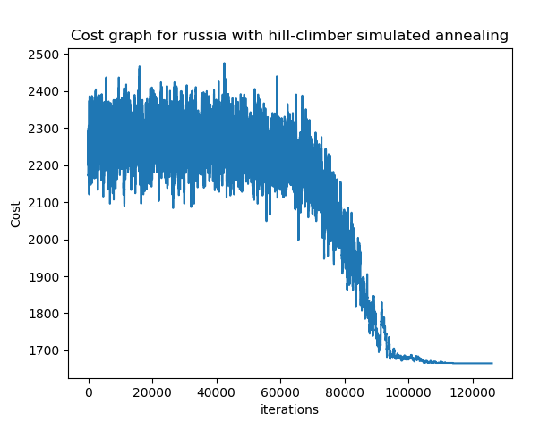
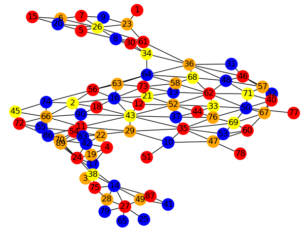

# QuMaDel

## Case
Our case is RadioRussia, to be found at http://heuristieken.nl/wiki/index.php?title=Radio_Russia.
In this case we are given a problem, to solve via heuristics.

The problem is as following:
Four  different countries: USA, Russia, Ukraine and China all are divided in states/provinces. All these states/provinces need radio transmitters. The problem we face is that no neighboring states/provinces can have the same type of transmitter.

## Preparation

For this project, networkx version 2.2 and matplotlib v3 are used, in combination with python 3.x

The install instructions for these programs are listed [here](requirements.md).

## usage

The program is run through main.py, located in the root folder.

Main.py uses an argument parser to process input.


```
usage: main [-h] [-c] [-a] [-clr] [-n] [-cs]

Running this program will generate a coloured graph representing a country
with given algorithm.

optional arguments:
  -h, --help            show this help message and exit
  -c {ukraine,china,usa,russia}, --country {ukraine,china,usa,russia}
                        Country to make graph of
  -a {random,greedy,kempe,hill_climber,hill_climber_n_opt,hill_climber_annealing}, --algorithm {random,greedy,kempe,hill_climber,hill_climber_n_opt,hill_climber_annealing}
                        The algorithm that will be used to make and colour the
                        graph.
  -clr {1,2,3,4,5,6,7}, --colors {1,2,3,4,5,6,7}
                        The amount of colors to use
  -n {1,2,3,4,5}, --n_opt {1,2,3,4,5}
                        Number of nodes to change when using
                        hill_climber_n_opt
  -cs {1,2,3,4}, --costscheme {1,2,3,4}
                        Which cost scheme to calculate costs with

```

### Example
```
$ python3 main.py -c china -a hill_climber -cs 3
```

Will produce a colored graph of China, with the hill climber algorithm, and returns the cost based on costscheme 3. The program will show the cost against each iteration in a line plot, and then the colored graph using networkx.

### Output
The program will output a line graph when asking for a hill climbing algorithm approach
like so



Next, the made graph will be shown regardless of chosen algorithm.

The legend for the colored graph from color to transmitter type is as follows:
red ==> 1
blue ==> 2
orange ==> 3
yellow ==> 4
purple ==> 5
green ==> 6
pink ==> 7


