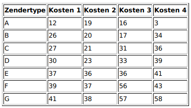

# Theorie exploratie

## Opdracht 1
a) Verzin een zenderinrichting voor de Oekraïne. Iedere provincie moet een zendertype hebben, geen enkele twee aangrenzende provincies mogen hetzelfde zendertype hebben. Verzin een zenderinrichting voor het hele land, en hoe minder zendertypes je gebruikt, hoe beter.

Zenderinrichting is te vergelijken met het kleuren van een landkaart. Beide zijn namelijk planaire grafen. Er bestaat een doorgerekend bewijs dat elke landkaart is te kleuren met 4 kleuren.

1 kleur is al triviaal voor 2 aangrenzende landen.
2 kleuren is niet toelaatbaar als er een cykel is.
3 kleuren zijn al veel landkaarten te kleuren. Landkaarten zijn niet 3 kleurbaar als er een punt is met oneven graad (>=3) en de buren een gesloten wandeling vormen.
4 kleurbaar is elke graaf uit de theorie.

Hieruit concluderen we dat er maximaal 4 kleuren nodig zijn. We checken of er een mogelijkheid is om 3 kleurbaar is, zo niet passen we 4 kleuren algoritme toe.

https://nl.wikipedia.org/wiki/Vierkleurenstelling
We kleuren de graaf met Kempe n-color theorem http://www.cs.princeton.edu/~appel/Color.pdf

b) Doe hetzelfde voor China, de USA en uiteindelijk voor moedertje Rusland. Hoe minder zenderypes, hoe beter.

Idem voor hierboven

c) De produktie van zenders wordt in Rusland uiteraard ook door de overheid beregeld. Het is het goedkoper om minder zendertypes te hebben, maar ook om van alle zendertypes ongeveer evenveel te hebben. Probeer voor ieder land met ieder minimumaantal zendertypes te bepalen hoe een evenwichtige verdeling eruit zou zien, en kijk of een inrichting mogelijk is met zo'n verdeling.

- Kempe heuristiek toepassen. Ipv random kleur aan node toepassen, kleur toepassen die minst is gebruikt. Dus door middel van lijst bijhouden hoevaak een kleur al is gebruikt.
- Iteratief algortime op toelaatbare oplossing die aan constraints voldoet. Een node met de kleur die het vaakst is gebruikt, de kleur geven die het minst is gebruikt en checken of oplossing nog steeds toelaatbaar is.

----------------------------------------------------------------------------------------------------------------------------------------------

## Opdracht 2
Er zijn vier mogelijke kostenschema's bekend geworden. Bekijk voor ieder land welk kostenschema de voordeligste inrichting oplevert.

Lastige van het probleem is dat wanneer je 1 zendertype toevoegd die duurder is, je misschien heel vaak eentje kan gebruiken die goedkoop is.
Idee is misschien om node met hoogste graad een duurdere kleur te geven. Dit is een future goal.

### Aanpak
Onze aanpak bevat een aantal variaties van een hill climber.

#### Klassieke hill climber
We hebben de klassieke hill climber, die een node zoekt om te veranderen, dit doet en dan kijkt of er verbetering is. Dit werkt goed om lagere kosten te krijgen, maar komt al snel in een lokaal optimum. Hierdoor is de kans klein dat met een keer dit uitvoeren de beste score behaald wordt.

#### n-opt hill_climber
In deze variatie kiezen we niet een node die veranderd kan worden, maar n. Wij verwachtten dat dit betere resultaten zou geven, maar dit bleek niet. Er is nog steeds sprake van lokale optima, maar ze worden minder snel behaald dan de klassieke hill climber.

#### Simulated annealing
Deze variatie van de hill climber doet hetzelfde als onze klassieke hill climber, maar accepteert verslechteringen in de kosten wel. De acceptatiekans wordt wel kleiner naarmate de iteraties vorderen. Met simulated annealing hebben we tot nog toe de beste resultaten geboekt.
----------------------------------------------------------------------------------------------------------------------------------------------

## State Space

De statespace voor Radio Russia is gemakkelijk te berekenen, er zijn in totaal 7 verschillende zendtypes die per provincie geplaatst kunnen worden. De formule van de upperbound wordt hierdoor gemakkelijk berekend:

State Space (losse punten) = aantal zendtypes ^ aantal provincies

Maar in ons geval van constraints waarbij aanliggende provincies niet hetzelfde zendtype mogen hebben, word de statespace een stuk lager. De eerste provincie heeft 7 mogelijke opties en de daarop volgende provincies steeds 6 verschillende zentypes waaruit ze kunnen kiezen. De  formule wordt hieroor:

State Space (aanliggende punten) =  aantal zendtypes * (aantal zendtypes - 1) ^ (aantal provincies - 1)

Als we deze twee voor een land als Ukraine berekenen:
losse punten: 1.3 * 10^21
aanliggende punten: 2.2 * 10^19

Invloed constaints op State Space
Wanneer de constaints worden toegepast wordt de state space een stuk kleiner.
Dit is ook van grote invloed op de Brute force, het getal is te groot om door te berekenen. Het probleem hiermee is dat de we niet precies weten hoeveel de state space kleiner wordt, want dat ligt ook aan de vorm van de graaf. Dus we kunnen geen garanties geven en daarom schatten we de state space in met aantal zendtypes ^ aantal provincies.

brute force bij losse punten = 4.1195394 × 10^12 jaar (400 miljard jaar)
brute force bij aanliggende punten = 6.97152822 × 10^10 jaar (7 miljard jaar)

Als een berekening een 1/10 seconde duurt:

state space Rusland:
losse punten: 7^82 = 1.986 * 10^69
aanliggende punten: 7.5 * 10^63

We hebben niet genoeg tijd om dit allemaal door te berekenen om onze computers.
Wanneer de constraints worden toegepast wordt de state space gelijk een stuk kleiner.

Kostenschema:
n = landen/provincies
i = {1,2,3,4}
strict upperbound = n * max(kostenschema(i))
strict lowerbound = n * min(kostenschema(i))

Onze 4 landen zijn allemaal met minimaal 4 kleuren te kleuren.
strict upperbound = n * max(kostenschema(i))
strict lowerbound = n * min(kostenschema(i))

---------------------------------------------------------------------------------------------------------------------------------------------

## Resultaten costs (Bij 2500 iteraties en sample size van 3000)

### Hillclimber n-opt:          

n=1
Min = 628
Avg = 681.22
Max = 755

n=2
Min = 628
Avg = 679.05
Max = 744

n=3
Min = 640
Avg = 682.645
Max = 740

n=4
Min = 643
Avg = 691/74
Max = 756

n = 5
Min =  642
Avg = 685
Max = 752

n = 6
Min = 647
Avg = 692
Max = 756
g
n = 7
Min = 656
Avg = 700
Max = 768

### Hillclimber annealing:
Min = 628
Avg = 644,05
Max = 695

Het algoritme wat leidt tot de beste resultaten is de Hillclimber annealing. Hij komt altijd in een minimum en de avarage en de max zijn over het algemeeen ook lager dan de n-opt hillclimbers.

Dit omdat de annealing werkt doormiddel van de temperatuur eerst hoog te maken en doordat de temp steeds lager word.
