# Results
Here the answers to the questions from the case will be answered.
As a bonus to this text, there is also an xls file in this folder, showing a comparison between a hill climber 1-opt and 2-opt. Here we can see that costscheme 2 is the cheapest.

Also that a 1-opt is usually more profitable than a 2-opt, but there is no certainty.

## Question 1
For question 1 we had to color all countries, with as little colors as possible.
We decided to do this with Kempe's algorithm, because this is a reliable algorithm
that will always yield a valid result.

### Ukraine
With the following command we created a colored graph of the Ukraine complying
to the constraint that no bordering provinces have the same color.
And at the same time there are only 4 colors, as this is the minimal amount possible
for a graph like this, as proved in our exploration.

```
python3 main.py -c ukraine -a kempe -clr 4 -cs 2
```
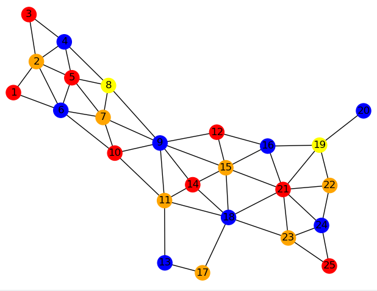

The cost of this graph is 505.

### China
Idem for China with the following command:

```
python3 main.py -c china -a kempe -clr 4 -cs 2
```
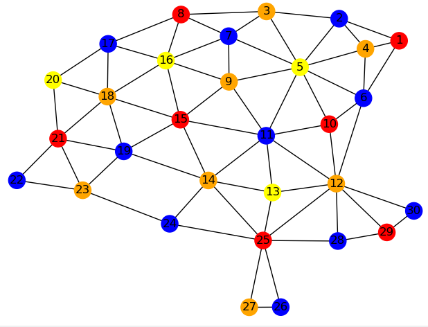

The cost of this graph is 613.

### USA  
Idem for USA with the following command:

```
python3 main.py -c usa -a kempe -clr 4 -cs 2
```
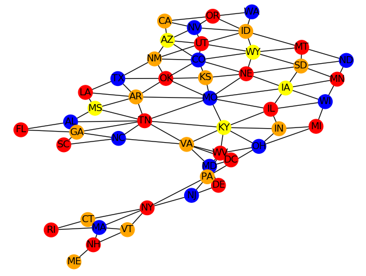

The cost of this graph is 990.

### Russia  

Lastly for Russia with the following command:

```
python3 main.py -c russia -a kempe -clr 4 -cs 2
```
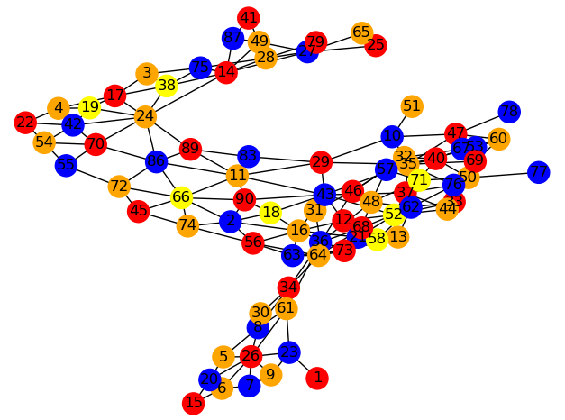

The cost of this graph is 1662.


## Question 2

To find the a low score for countries, a hill climber is used.
Here we will show what this looks like for all countries.
Instead of a normal hill climber, simulated annealing or an n-opt approach will work.

Our research found that simulated in most cases produces the best results.
Together with the fact that we know that cost scheme 2 is the cheapest, that is
how we will show the results.

### Ukraine
For Ukraine we run
```
python3 main.py -c ukraine -a hill_climber_annealing -cs 2
```
This produces the following results

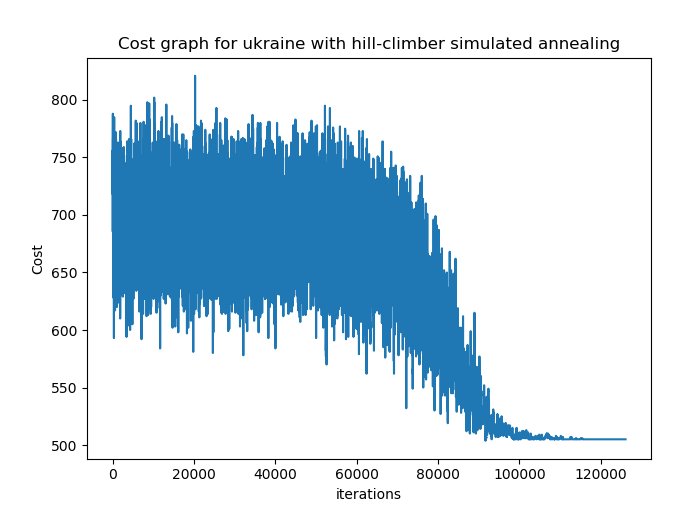
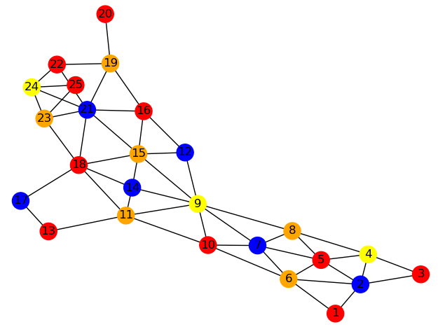

The cost of this graph is 505.

### China
Idem for China. We run
```
python3 main.py -c china -a hill_climber_annealing -cs 2
```
This produces the following results

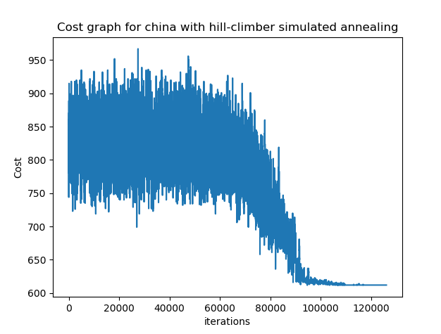
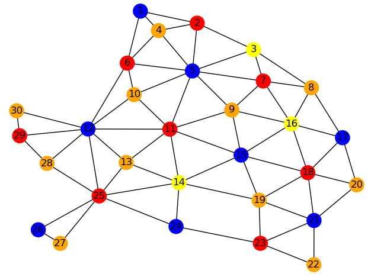

The cost of this graph is 612.

### USA
Idem for USA. We run
```
python3 main.py -c usa -a hill_climber_annealing -cs 2
```
This produces the following results

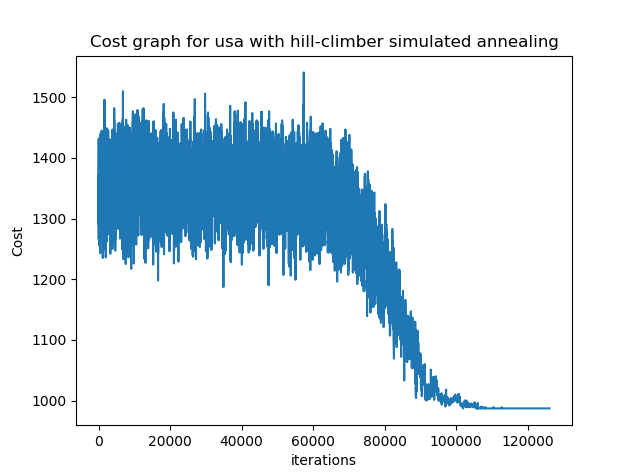
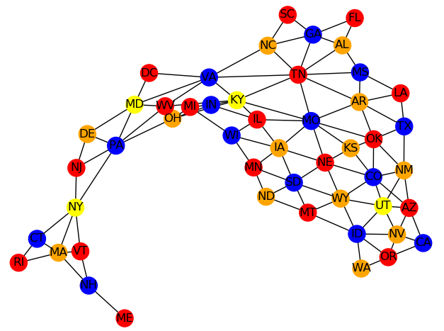

The cost of this graph is 987
.
### Russia
Lastly for Russia. We run
```
python3 main.py -c russia -a hill_climber_annealing -cs 2
```
This produces the following results

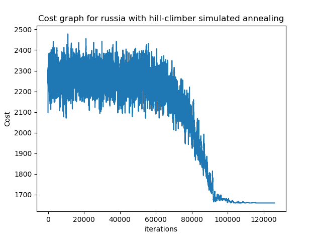
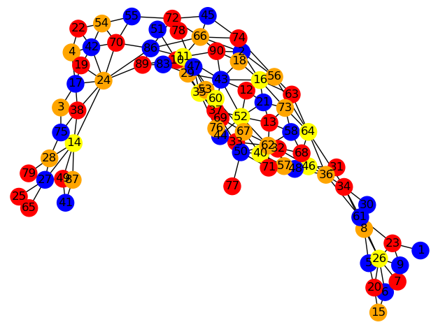

The cost of this graph is 1660.

## Conclusion

As we can see, the difference between using kempe's algorithm and a simulated annealing
that runs for about 130.000 iterations, there is hardly any difference.

## Dicussion

The annealing algorithm is run only once, therefore we suspect lower scores are possible.
We unfortunately have no time to prove this, because there's no time to run the program.
